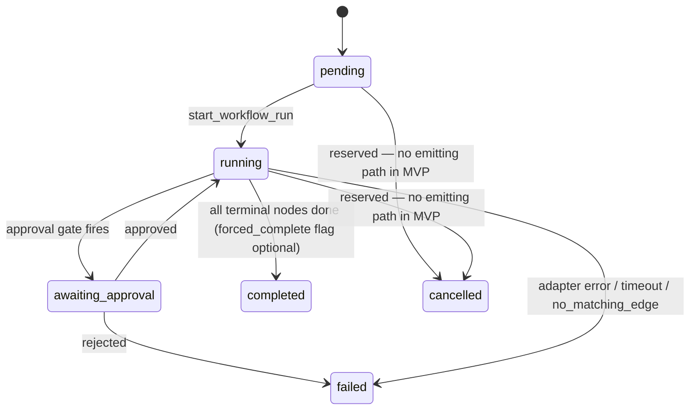
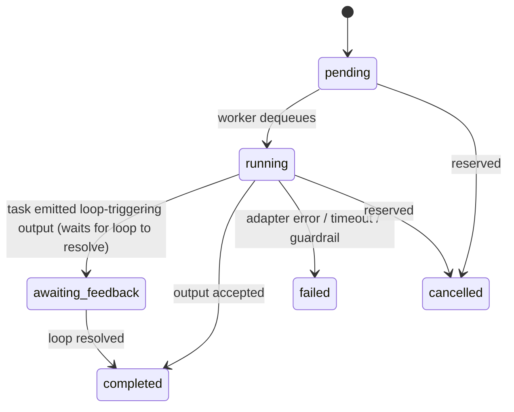
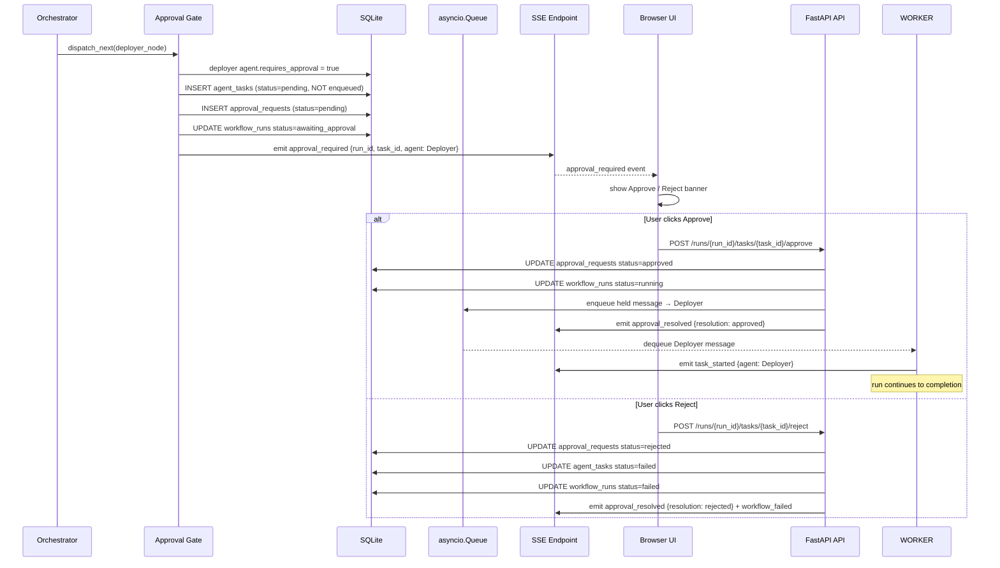
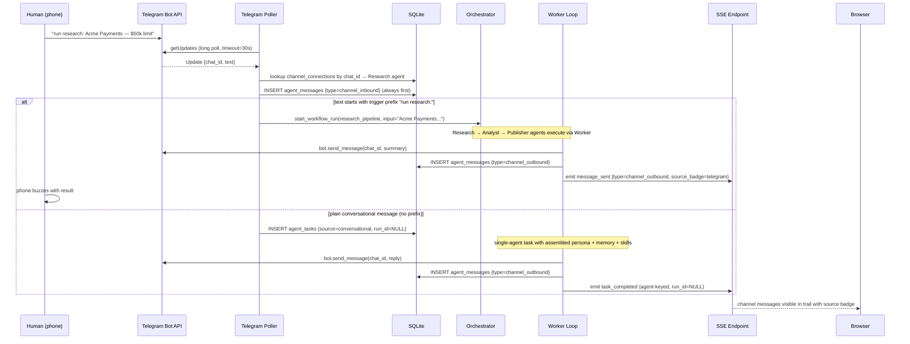

# Project Yuno — Build Specification

**Version 1.0 — split from SYSTEM_DESIGN.md v2.1, 2026-06-12**

> This document is authoritative for implementation behavior, contracts, acceptance criteria, and validation. When this document and `SYSTEM_DESIGN.md` address the same topic, architecture lives in SD and binding behavior lives here. When PRD, spike evidence, SD, or `stories.md` conflict with this document, report the conflict rather than resolving it silently.

---

## 1. Document Purpose and Authority

**Source hierarchy (binding order):**

1. `project_yuno.pdf` — authoritative product requirements document
2. `_bmad-output/planning-artifacts/goose-spike-report.md` — authoritative for verified Goose 1.37.0 runtime behavior; no runtime claim may contradict it
3. `SYSTEM_DESIGN.md` — authoritative for architectural decisions and system boundaries
4. This document (`BUILD_SPEC.md`) — authoritative for implementation behavior, contracts, acceptance criteria, and validation
5. `_bmad-output/planning-artifacts/stories.md` — authoritative for the approved implementation sequence; stories may not contradict or silently narrow this specification
6. Code must conform to all applicable documents above

When any two documents conflict, report the conflict; do not resolve it silently.

---

## 2. Binding MVP Scope

The following must function in the submitted MVP with no caveats except those explicitly listed in §22:

- Agent CRUD with all six PRD fields (name, role, system prompt, model, tool access, communication channels), editable in both the API and the browser
- All five agent-configuration dimensions each observably changing runtime behavior: schedules (fires without manual action), memory (appears in a reply), skills (shapes execution), interaction rules (approval gate pauses and resumes a run from the UI), guardrails (token budget halts a run)
- Visual workflow builder: load a template onto a React Flow canvas, modify at least one node and one edge/condition, modify the feedback-loop max-iterations, save as a new workflow, run the modified version
- At least two structurally different templates, both loadable and runnable
- Live Telegram conversation: a real inbound message → real Goose-executed reply; a trigger phrase launching a workflow from the same chat
- Real runtime execution: Goose 1.37.0 via the ACP server with a native provider; at least one `tool_call` event captured and persisted
- Agent-to-agent messages persisted in order with message type and source
- Live monitoring via SSE: expandable run rows with conversation trail, tool calls, token/cost totals
- Automated tests: three named critical-path tests green; one opt-in live Goose test runnable
- Single setup command: `make setup` then `make dev`, non-interactive, fresh-clone verified
- README with architecture diagram, setup instructions, runtime tradeoff justification, extension instructions
- Recorded demo: a full live rehearsal passes before recording; recording includes the live Telegram conversation and the builder-modification beat

---

## 3. Requirements Traceability Matrix

| ID | PRD Requirement | Mechanism | User-visible evidence | Automated validation | Manual validation | Story |
|---|---|---|---|---|---|---|
| R01 | Agent CRUD (6 fields) | FastAPI router; `agents` + `agent_config` tables; browser form (S4) | Agent form with all six fields | `test_agent_create.py` | — | S1, S4 |
| R02 | Config: schedules | APScheduler 3.x; `schedules` table; browser schedule form | Schedule-fired run visible in monitor without manual action | `test_limits.py` (run-rate) | AC-6 manual check | S4 |
| R03 | Config: memory | `memory_entries` CRUD + context injection; browser memory rows | Memory fact appears in a live reply | `test_agent_create.py` (assembly unit) | AC-5 live | S4 |
| R04 | Config: skills | `skills` table; per-agent ordered steps; browser skill list; injected into preamble | Agent follows skill steps in a run | assembly unit test | demo beat 6 | S4 |
| R05 | Config: guardrails | Worker: token budget, run-rate, blocked extensions (§13) | `guardrail_triggered` event + run halts | `test_limits.py` | demo guardrail beat | S4 |
| R06 | Workflow builder, configurable loops | React Flow canvas + nodes/edges API | Modified workflow run honors edits | `test_template_modify.py` | AC-1, AC-2 | S5 |
| R07 | 2 templates, load and modify | Seed + builder | Both templates load; one modified and run | `test_template_modify.py` | AC-2 | S2, S5, S6 |
| R08 | External channel (Telegram) | python-telegram-bot v21+ long polling | Live round-trip and trigger phrase | `test_telegram_routing.py` | AC-5 live | S3 |
| R09 | Live monitoring (status, logs, tokens, cost) | `execution_events` → sse-starlette; usage from ACP | Run rows with token/cost totals update live | `test_sse_events.py` | monitor beat | S2 |
| R10 | Async agent comms + persisted trail | asyncio.Queue + worker; `agent_messages` | Conversation trail in expanded run row | `test_message_delivery.py` | — | S2 |
| R11 | Real runtime + real tools | `AcpGooseAdapter`; native provider | `tool_call` event persisted; on-disk artifact | `test_acp_adapter.py`; `pytest -m live` | AC-4 smoke gate | S1 |
| R12 | Working E2E demo | All components | Recorded 8-beat demo | `test_workflow_run_e2e.py` | AC-8 | S6 |
| R13 | Feedback loop, configurable | Orchestrator; free-form edge conditions | Loop fires; cap produces `forced_complete=true` | `test_limits.py`; `test_workflow_run_e2e.py` | AC-1 | S2 |
| R14 | Interaction rules (approval gate) | Pre-dispatch gate; `approval_requests` | Run pauses; Approve/Reject UI | e2e approval branch | AC demo beat 4 | S4 |
| R15 | Single setup command | Makefile | `make setup && make dev` works from fresh clone | — | AC-7 | S6 |

---

## 4. Acceptance Criteria

These are binding. None may be silently cut or narrowed.

- **AC-1 — Configurable loop:** In the builder, user edits the loop edge target, branch condition, and max iterations; a subsequent run honors the edits.
- **AC-2 — Template modify:** Load template → change ≥1 node and ≥1 edge/condition in the UI → save → run modified version successfully.
- **AC-3 — Three critical-path tests:** Named automated tests pass: `test_agent_create.py` (API→DB), `test_workflow_run_e2e.py` (2-agent flow, mocked adapter), `test_message_delivery.py` (persist + deliver + order). Plus one opt-in live-Goose integration test runnable via `pytest -m live`.
- **AC-4 — Real-runtime gate:** Day-1 smoke: one real Goose invocation (`make smoke-goose`) with one real `tool_call` event captured and an on-disk artifact asserted, before any app code builds on the adapter. Recorded ACP frames from this run become fixtures for `test_acp_adapter.py`.
- **AC-5 — Channel personality/tools/memory:** Live Telegram reply observably reflects a configured persona and a stored memory fact, in the recording.
- **AC-6 — Schedules:** User sets a 1-minute interval schedule in the UI; scheduler fires a run visible in the monitor without any manual action.
- **AC-7 — Setup commands:** Fresh clone → `make setup` once → `make dev` → backend + frontend + runtime + seeded templates up; no interactive steps; verified Day-2 morning.
- **AC-8 — Demo recording:** One full live rehearsal (real Goose + real Telegram) passes before recording; recording includes the builder-modification beat and the live Telegram conversation.

---

## 5. Domain Contracts

### 5.1 Entity Definitions

**Agent** — `id` (UUID), `name` (unique), `role`, `system_prompt` (default `''`), `model` (seeded from `GOOSE_MODEL` env; no hardcoded constant), `status` (`active`|`inactive`|`error`), `created_at`.

**AgentConfig** — one row per agent: `extensions` (JSON list of extension names, e.g. `["developer"]`), `requires_approval` (bool; interaction rule — pre-dispatch gate), `max_tokens_per_run` (default 50000; guardrail), `max_runs_per_minute` (default 6; guardrail), `blocked_extensions` (JSON list; guardrail), `max_feedback_iterations` (default 2), `max_turns` (default 10; passed to Goose `--max-turns` on CLI path), `timeout_seconds` (default 180).

**MemoryEntry** — `id`, `agent_id`, `key`, `value`, `created_at`. `(agent_id, key)` unique. Full CRUD in the UI; injected into the assembled context on every invocation.

**Skill** — `id`, `agent_id`, `name`, `description`, `steps` (JSON array of step strings). Editable in the UI; injected into the assembled context.

**Schedule** — `id`, `agent_id`, `trigger_type` (`cron`|`interval`), `expression` (crontab string or interval seconds as text), `trigger_workflow_id` (nullable — null = single-agent task), `task_prompt`, `enabled` (bool).

**ChannelConnection** — `id`, `agent_id`, `channel_type` (default `telegram`), `channel_id` (Telegram chat_id), `trigger_workflow_id` (nullable), `active` (bool). `(channel_type, channel_id)` unique.

**Workflow** — `id`, `name`, `description`, `template_key` (nullable; `dev_pipeline`|`research_pipeline`|NULL for user-created).

**WorkflowNode** — `id`, `workflow_id`, `agent_id`, `node_type` (`start`|`middle`|`end`), `task_prompt`, `position_x`, `position_y`.

**WorkflowEdge** — `id`, `from_node_id`, `to_node_id`, `condition` (free-form string; `"always"` or a substring-match string), `max_iterations` (nullable; loop edges only; null = target agent's `max_feedback_iterations`).

**WorkflowRun** — `id`, `workflow_id`, `status` (`pending`|`running`|`awaiting_approval`|`completed`|`failed`|`cancelled`), `forced_complete` (bool, default false), `started_at`, `completed_at`, `total_tokens` (int, default 0), `total_cost` (real, default 0.0).

**AgentTask** — `id`, `run_id` (**nullable** — NULL for standalone tasks), `node_id` (**nullable** — NULL for standalone tasks), `agent_id`, `source` (`workflow`|`conversational`|`scheduled`), `status` (`pending`|`running`|`awaiting_feedback`|`completed`|`failed`|`cancelled`), `input`, `output` (nullable), `feedback_iteration_count` (default 0), `tokens_used`, `cost_usd`, `started_at`, `completed_at`. Workflow tasks have both `run_id` and `node_id`; conversational and standalone scheduled tasks have neither.

**AgentMessage** — `id`, `run_id` (nullable), `from_task_id` (nullable — null for channel_inbound / schedule-originated), `to_task_id` (nullable; matches the dataclass field name — v1 `to_node_id` mismatch fixed), `msg_type` (`task_output`|`feedback`|`channel_inbound`|`channel_outbound`), `payload` (JSON; `{"content": str, "chat_id": str|null, "agent_id": str|null}`), `created_at`.

**ApprovalRequest** — `id`, `run_id`, `task_id`, `description`, `status` (`pending`|`approved`|`rejected`), `created_at`, `resolved_at` (nullable).

**ExecutionEvent** — `id`, `run_id` (**nullable** — null for run-less task events), `agent_id` (nullable — set for run-less task events), `task_id` (nullable), `event_type`, `data` (JSON), `created_at`.

### 5.2 SQL Schema

```sql
PRAGMA journal_mode=WAL;

CREATE TABLE agents (
    id            TEXT PRIMARY KEY,
    name          TEXT NOT NULL UNIQUE,
    role          TEXT NOT NULL,
    system_prompt TEXT NOT NULL DEFAULT '',
    model         TEXT NOT NULL,
    status        TEXT NOT NULL DEFAULT 'active' CHECK (status IN ('active','inactive','error')),
    created_at    TEXT NOT NULL DEFAULT (datetime('now'))
);

CREATE TABLE agent_config (
    id                      TEXT PRIMARY KEY,
    agent_id                TEXT NOT NULL UNIQUE REFERENCES agents(id) ON DELETE CASCADE,
    extensions              TEXT NOT NULL DEFAULT '["developer"]',
    requires_approval       INTEGER NOT NULL DEFAULT 0,
    max_tokens_per_run      INTEGER NOT NULL DEFAULT 50000,
    max_runs_per_minute     INTEGER NOT NULL DEFAULT 6,
    blocked_extensions      TEXT NOT NULL DEFAULT '[]',
    max_feedback_iterations INTEGER NOT NULL DEFAULT 2,
    max_turns               INTEGER NOT NULL DEFAULT 10,
    timeout_seconds         INTEGER NOT NULL DEFAULT 180
);

CREATE TABLE memory_entries (
    id         TEXT PRIMARY KEY,
    agent_id   TEXT NOT NULL REFERENCES agents(id) ON DELETE CASCADE,
    key        TEXT NOT NULL,
    value      TEXT NOT NULL,
    created_at TEXT NOT NULL DEFAULT (datetime('now')),
    UNIQUE(agent_id, key)
);

CREATE TABLE skills (
    id          TEXT PRIMARY KEY,
    agent_id    TEXT NOT NULL REFERENCES agents(id) ON DELETE CASCADE,
    name        TEXT NOT NULL,
    description TEXT NOT NULL DEFAULT '',
    steps       TEXT NOT NULL DEFAULT '[]'
);

CREATE TABLE schedules (
    id                  TEXT PRIMARY KEY,
    agent_id            TEXT NOT NULL REFERENCES agents(id) ON DELETE CASCADE,
    trigger_type        TEXT NOT NULL DEFAULT 'cron' CHECK (trigger_type IN ('cron','interval')),
    expression          TEXT NOT NULL,
    trigger_workflow_id TEXT REFERENCES workflows(id),
    task_prompt         TEXT NOT NULL DEFAULT '',
    enabled             INTEGER NOT NULL DEFAULT 1
);

CREATE TABLE channel_connections (
    id                  TEXT PRIMARY KEY,
    agent_id            TEXT NOT NULL REFERENCES agents(id) ON DELETE CASCADE,
    channel_type        TEXT NOT NULL DEFAULT 'telegram',
    channel_id          TEXT NOT NULL,
    trigger_workflow_id TEXT REFERENCES workflows(id),
    active              INTEGER NOT NULL DEFAULT 1,
    UNIQUE(channel_type, channel_id)
);

CREATE TABLE workflows (
    id           TEXT PRIMARY KEY,
    name         TEXT NOT NULL,
    description  TEXT NOT NULL DEFAULT '',
    template_key TEXT
);

CREATE TABLE workflow_nodes (
    id          TEXT PRIMARY KEY,
    workflow_id TEXT NOT NULL REFERENCES workflows(id) ON DELETE CASCADE,
    agent_id    TEXT NOT NULL REFERENCES agents(id),
    node_type   TEXT NOT NULL DEFAULT 'middle' CHECK (node_type IN ('start','middle','end')),
    task_prompt TEXT NOT NULL DEFAULT '',
    position_x  INTEGER NOT NULL DEFAULT 0,
    position_y  INTEGER NOT NULL DEFAULT 0
);

CREATE TABLE workflow_edges (
    id             TEXT PRIMARY KEY,
    from_node_id   TEXT NOT NULL REFERENCES workflow_nodes(id) ON DELETE CASCADE,
    to_node_id     TEXT NOT NULL REFERENCES workflow_nodes(id) ON DELETE CASCADE,
    condition      TEXT NOT NULL DEFAULT 'always',
    max_iterations INTEGER
);

CREATE TABLE workflow_runs (
    id              TEXT PRIMARY KEY,
    workflow_id     TEXT NOT NULL REFERENCES workflows(id),
    status          TEXT NOT NULL DEFAULT 'pending'
        CHECK (status IN ('pending','running','awaiting_approval','completed','failed','cancelled')),
    forced_complete INTEGER NOT NULL DEFAULT 0,
    started_at      TEXT,
    completed_at    TEXT,
    total_tokens    INTEGER NOT NULL DEFAULT 0,
    total_cost      REAL NOT NULL DEFAULT 0.0
);

CREATE TABLE agent_tasks (
    id                       TEXT PRIMARY KEY,
    run_id                   TEXT REFERENCES workflow_runs(id) ON DELETE CASCADE,
    node_id                  TEXT REFERENCES workflow_nodes(id),
    agent_id                 TEXT NOT NULL REFERENCES agents(id),
    source                   TEXT NOT NULL DEFAULT 'workflow'
        CHECK (source IN ('workflow','conversational','scheduled')),
    status                   TEXT NOT NULL DEFAULT 'pending'
        CHECK (status IN ('pending','running','awaiting_feedback','completed','failed','cancelled')),
    input                    TEXT NOT NULL DEFAULT '',
    output                   TEXT,
    feedback_iteration_count INTEGER NOT NULL DEFAULT 0,
    tokens_used              INTEGER NOT NULL DEFAULT 0,
    cost_usd                 REAL NOT NULL DEFAULT 0.0,
    started_at               TEXT,
    completed_at             TEXT
);
CREATE INDEX idx_agent_tasks_run_id ON agent_tasks(run_id);

CREATE TABLE agent_messages (
    id           TEXT PRIMARY KEY,
    run_id       TEXT REFERENCES workflow_runs(id),
    from_task_id TEXT REFERENCES agent_tasks(id),
    to_task_id   TEXT REFERENCES agent_tasks(id),
    msg_type     TEXT NOT NULL CHECK (msg_type IN
                     ('task_output','feedback','channel_inbound','channel_outbound')),
    payload      TEXT NOT NULL DEFAULT '{}',
    created_at   TEXT NOT NULL DEFAULT (datetime('now'))
);
CREATE INDEX idx_agent_messages_run_id ON agent_messages(run_id);

CREATE TABLE approval_requests (
    id          TEXT PRIMARY KEY,
    run_id      TEXT NOT NULL REFERENCES workflow_runs(id),
    task_id     TEXT NOT NULL REFERENCES agent_tasks(id),
    description TEXT NOT NULL,
    status      TEXT NOT NULL DEFAULT 'pending' CHECK (status IN ('pending','approved','rejected')),
    created_at  TEXT NOT NULL DEFAULT (datetime('now')),
    resolved_at TEXT
);

CREATE TABLE execution_events (
    id         TEXT PRIMARY KEY,
    run_id     TEXT REFERENCES workflow_runs(id),
    agent_id   TEXT REFERENCES agents(id),
    task_id    TEXT REFERENCES agent_tasks(id),
    event_type TEXT NOT NULL,
    data       TEXT NOT NULL DEFAULT '{}',
    created_at TEXT NOT NULL DEFAULT (datetime('now'))
);
CREATE INDEX idx_execution_events_run_id ON execution_events(run_id);
```

---

## 6. API Contracts

### Core Endpoints

| Method | Path | Purpose |
|---|---|---|
| POST | `/agents` | Create agent + config (single transaction) |
| GET | `/agents` | List agents |
| GET | `/agents/{id}` | Get agent with config |
| PUT | `/agents/{id}` | Update agent core fields |
| DELETE | `/agents/{id}` | Delete agent (cascade) |
| PUT | `/agents/{id}/config` | Update agent_config row |
| GET/POST/PUT/DELETE | `/agents/{id}/memory` | Memory entries CRUD |
| GET/POST/PUT/DELETE | `/agents/{id}/skills` | Skills CRUD |
| GET/POST/PUT/DELETE | `/agents/{id}/schedules` | Schedules CRUD (registers/removes APScheduler jobs live) |
| GET/POST/DELETE | `/agents/{id}/channels` | Channel connections CRUD |
| GET/POST | `/workflows` | List / create workflow |
| GET/PUT | `/workflows/{id}` | Get / update workflow (full nodes+edges for the builder) |
| POST | `/workflows/{id}/duplicate` | Duplicate workflow (save-as in the builder) |
| POST | `/workflows/{id}/runs` | Start a workflow run |
| GET | `/runs/{id}` | Get run with tasks and messages |
| GET | `/runs/{id}/events` | REST history of execution events |
| GET | `/events` | SSE stream (`?run_id=X` or `?agent_id=X`) |
| POST | `/runs/{id}/tasks/{task_id}/approve` | Approve a paused task |
| POST | `/runs/{id}/tasks/{task_id}/reject` | Reject a paused task |
| GET | `/health` | Health check → `{"status": "ok"}` |

`POST /runs/{id}/cancel` is **cut from scope** (PRD never asks for cancellation). The `cancelled` status values remain reserved in the schema enums with no emitting path in this version.

### Graph validation on `POST /workflows/{id}/runs`

Returns `400` with structured error for: orphan node (connected to no edges), missing agent reference, no start node.

---

## 7. Runtime Contract

All claims in this section are verified against Goose CLI 1.37.0. See `goose-spike-report.md` for raw evidence.

### 7.1 Adapter Interface

```python
@dataclass
class TaskInput:
    context_preamble: str       # assembled preamble: role + instructions + memory + skills + interaction rules
    task_content: str           # the actual task (from prior agent output, user input, schedule, or Telegram)
    model: str                  # from agent row
    extensions: list[str]       # extension names after blocked_extensions filtering
    max_turns: int
    timeout_seconds: int

@dataclass
class TaskResult:
    output: str
    tool_calls: list[dict]      # [{"tool": str, "status": str, "detail": dict}] from tool_call events
    tokens_input: int
    tokens_output: int
    tokens_total: int           # from ACP usage_update / final result usage
    estimated_cost: float       # tokens × per-model pricing table; labeled "estimate" in UI
    session_id: str | None      # ACP sessionId, or None on the CLI path

class AgentRuntimeAdapter(ABC):
    @abstractmethod
    async def invoke(self, task: TaskInput, on_event: Callable[[dict], Awaitable[None]]) -> TaskResult: ...
    @abstractmethod
    async def health_check(self) -> bool: ...
```

`on_event` forwards `tool_call` / `usage_update` notifications to the SSE bus mid-run.

### 7.2 AcpGooseAdapter — Verified Protocol (Spike §§1–8)

**Server startup:** `goose serve --port 3284 --with-builtin developer`. Health: `GET /health` → `ok`.

**Transport:** JSON-RPC 2.0, protocolVersion 1, over HTTP.
- `POST /acp` with JSON-RPC request → `202 Accepted` (empty body); response arrives on SSE stream
- `GET /acp` with `Accept: text/event-stream` → SSE stream (`406` without the header)
- WebSocket upgrade at the same path also supported (observed `101`)

**Routing headers:**
- Server issues `acp-connection-id` on the connection-level SSE stream
- Session-scoped calls require `Acp-Session-Id` header or HTTP 400 is returned: `Bad Request: Acp-Session-Id header required for session-scoped methods`
- A session-scoped SSE stream requires **both** `acp-connection-id` and `Acp-Session-Id`; a connection-only stream receives no session-update notifications

**Methods used:** `initialize`, `session/new`, `session/prompt`, `session/set_mode`, `session/load`, `session/list`, `session/close`.

**No HTTP auth** on this surface (spike §3). The only credential is the provider key in the Goose process environment.

**Per-invocation lifecycle:**
1. (Once per connection) `initialize` → capabilities: `loadSession: true`, `promptCapabilities: {image: true, embeddedContext: true}`, `mcpCapabilities: {http: true}`, `sessionCapabilities: {list, close}`
2. `session/new {cwd: <run-workspace-dir>, mcpServers: <per-agent MCP extensions>}` → SSE result: `{sessionId, modes, ...}`
3. Open session-scoped SSE stream (`GET /acp` + both headers)
4. `session/prompt` whose first turn is the assembled context preamble + task content
5. Consume `session/update` notifications: `agent_message_chunk` (concatenate into `output`), `tool_call` / `tool_call_update` (forward via `on_event`, accumulate into `tool_calls`), `usage_update`, `session_info_update`
6. Terminate on final result: `{"result": {"stopReason": "end_turn", "usage": {"inputTokens": N, "outputTokens": N, "totalTokens": N}}, "id": N}` (observed shape — spike §5)
7. `session/close`

**`tool_call` / `request_permission` note:** these event types are ACP-standard and not yet captured live (only CLI-bridge providers were available during the spike; the native provider produces them). Capturing one `tool_call` event is the Day-1 smoke gate (AC-4).

**Error behavior (spike §8):**
- Missing session header → HTTP 400 + plain-text reason
- Unconfigured provider → `session/prompt` fails fast with HTTP 400 naming the missing env var
- SSE keepalive comments (`:`) flow during idle
- Malformed JSON-RPC to `/acp` → JSON-RPC error response

**Native provider requirement (C4 — load-bearing):** with CLI-bridge providers (`claude-code`, `gemini-cli`) the tool loop runs inside the bridged CLI subprocess — tools execute but no `tool_call` events and no permission requests cross ACP, and approve mode is silently bypassed (observed). The platform must use `GOOSE_PROVIDER=anthropic` + `ANTHROPIC_API_KEY`.

**Extension registration mechanisms (spike §6):**
- `--with-builtin <name>` on `goose serve` (server-wide; `developer` is always registered this way)
- `mcpServers` param on `session/new` (per-session MCP extension injection — how the platform adds per-agent extensions beyond the builtin)
- Per-session *removal* of a server-level builtin is **not a verified mechanism** on the ACP path

**Goose sessions persistence:** `~/.local/share/goose/sessions/sessions.db`; useful for debugging, not platform state.

### 7.3 CliGooseAdapter — Contingency

Build on demand only if: (a) ACP smoke gate fails at hour 0/1 of Day 1, or (b) an agent's `blocked_extensions` includes `developer` (per-session removal of a server-level builtin is not verified on the ACP path; the CLI recipe `extensions:` list is per-run and verified).

```
goose run --recipe rendered/<agent>.yaml --params task="<task_content>" \
          --no-session --max-turns <N>
```

One subprocess per workflow node; stdout captured as `output`; non-zero exit fails the task. Tradeoffs vs ACP: no mid-run `tool_call` event stream; no native usage notifications (token fields fall back to a client-side estimate, labeled as such in the UI). Same runtime, compliant.

**Recipe format** (validated by `goose recipe validate` in the spike):
```yaml
version: 1.0.0
title: <agent.name>
description: <agent.role>
instructions: <assembled context preamble>
prompt: "{{ task }}"
parameters:
  - key: task
    input_type: string
    requirement: required
extensions:
  - type: builtin
    name: <extension-name>   # one entry per allowed extension
settings:
  goose_provider: anthropic
  goose_model: <agent.model>
```

---

## 8. Context Assembly Contract

ACP has no per-session system-prompt field; the platform-owned persona travels as a structured preamble in the **first prompt turn** of each session:

```
## Role
{agent.role} — {agent.name}

## Instructions
{agent.system_prompt}

## Memory (persistent facts — honor these)
- {key}: {value}
…

## Skills (follow the matching procedure step by step)
### {skill.name}
{steps as numbered list}
…

## Interaction rules
{e.g. "Destructive or irreversible actions are pre-approved by the operator for this run."}

---
## Task
{task_content}
```

Rules:
- Channel input (Telegram inbound, inter-agent output) enters **only** the `## Task` section — never the persona sections (prompt-injection boundary)
- The same assembled content renders into a recipe's `instructions` field for the CLI path and `goose schedule` path
- Memory section omitted if agent has no memory entries; Skills section omitted if agent has no skills; Interaction rules section omitted if `requires_approval=false`

---

## 9. Workflow Execution Contract

### 9.1 Start

`start_workflow_run(workflow_id, initial_input) → run_id`. Validates the graph before creating the run (see §6 graph-validation rules). Creates `workflow_runs` row (`status=pending`), creates the start node's `agent_tasks` row (`source='workflow'`), emits `workflow_started`, enqueues the start message.

### 9.2 Edge Evaluation

```python
def edge_matches(condition: str, output: str | None) -> bool:
    if condition == "always":
        return True
    return condition.lower() in (output or "").lower()
```

Matching is case-insensitive substring containment. All edges from the completed node are evaluated; all matching edges fan out simultaneously. For the two-day scope, seed templates are linear with one loop edge each — simultaneous fan-out is not exercised.

```python
async def advance_workflow(run_id: str, completed_task: AgentTask) -> None:
    node = await repo.get_node(completed_task.node_id)
    edges = await repo.get_edges_from(node.id)
    matched = [e for e in edges if edge_matches(e.condition, completed_task.output)]
    matched = self._apply_loop_cap(run_id, completed_task, matched)   # §9.3

    for edge in matched:
        await self._dispatch_next(run_id, edge.to_node_id, completed_task)  # via Approval Gate

    if not matched:
        if node.node_type == "end":
            await repo.update_run_status(run_id, "completed")
        else:
            await repo.update_run_status(run_id, "failed")
            await emit_event(run_id, {"type": "workflow_failed", "reason": "no_matching_edge"})
```

### 9.3 Feedback-Loop Cap

A loop edge (an edge pointing to an already-executed node) may be taken at most `max_iterations` times per run. `max_iterations` resolves as: edge-level `max_iterations` if non-null, otherwise the target agent's `max_feedback_iterations` (default **2**).

**On the Nth+1 match** (where N = resolved `max_iterations`): the loop edge is **skipped** — the orchestrator emits `feedback_loop_capped` and evaluates the remaining (non-loop) edges from the same node. If none match, the run is marked `completed` with `forced_complete=true`.

**The run is NOT failed.** A capped loop is a bounded disagreement, not an error; the sender's last output is accepted as final. `forced_complete=true` is persisted in `workflow_runs` and carried in the `workflow_completed` event.

Example: the Reviewer may send the Coder back twice (iterations 1 and 2). On the 3rd REJECTED match, the loop edge is skipped, `feedback_loop_capped` is emitted, and the run completes with `forced_complete=true`.

### 9.4 Timeout

Each invocation is wrapped in `asyncio.wait_for(adapter.invoke(...), timeout=config.timeout_seconds)`. A `TimeoutError` fails the task and the run loudly — no retry.

### 9.5 Failure Modes

| Failure | Behavior |
|---|---|
| Adapter error | Task `failed`; run `failed`; `workflow_failed` event with verbatim error |
| Timeout | Same as adapter error |
| No matching edge on a non-end node | Run `failed`; `workflow_failed` reason: `no_matching_edge` |
| Graph validation failure | `POST …/runs` → 400; run never created |
| Goose unreachable at startup | `make dev` preflight aborts with remediation message |
| Provider key missing | `session/prompt` HTTP 400; task + run failed |

---

## 10. State Machines

### WorkflowRun



### AgentTask



`awaiting_feedback` is owned by the **sending** task (e.g. the Reviewer that rejected) while the looped-to task (Coder, iteration 2) runs — the sending task is not yet terminal.

### ApprovalRequest

```
pending → approved (POST …/approve) → [run resumes]
pending → rejected (POST …/reject) → [task + run failed]
```

---

## 11. Agent Message Contract

### Envelope

```python
@dataclass
class AgentMessage:
    id: UUID
    run_id: UUID | None         # null for pure conversational channel messages
    from_task_id: UUID | None   # null for channel_inbound / schedule-originated
    to_task_id: UUID | None     # destination AgentTask (created before the message)
    msg_type: Literal["task_output", "feedback", "channel_inbound", "channel_outbound"]
    payload: dict               # {"content": str, "chat_id": str | None, "agent_id": str | None}
    created_at: datetime
```

### Delivery

1. The sender writes the `AgentMessage` row to the DB
2. **Then** puts it on the single `asyncio.Queue` (`maxsize=1000`)
3. The single worker consumes FIFO
4. Within a run, message ordering is guaranteed by the single consumer
5. Messages from concurrent runs may interleave but are isolated by `run_id`

The persisted rows are the PRD-required conversation trail; the expanded run row in the Live Monitor renders them directly.

No at-least-once delivery, no idempotency machinery, no retry-with-backoff. A worker exception fails the task and run with a `workflow_failed` event and a structured log line.

---

## 12. Event Contract

All events are persisted to `execution_events` before being delivered to SSE subscribers. Reconnect = client calls `GET /runs/{id}/events` (REST history) then resubscribes.

| Event type | Trigger | Required fields in `data` | Persistence |
|---|---|---|---|
| `workflow_started` | `start_workflow_run` | `run_id, workflow_id` | `run_id` set |
| `workflow_completed` | All terminal nodes done | `run_id, forced_complete` | `run_id` set |
| `workflow_failed` | Error / no_matching_edge | `run_id, reason` | `run_id` set |
| `task_started` | Worker dequeues | `run_id, task_id, agent_id` | `run_id` or null |
| `task_completed` | Worker finishes | `run_id, task_id, output_preview` | `run_id` or null |
| `task_failed` | Adapter error / timeout / guardrail | `run_id, task_id, error` | `run_id` or null |
| `tool_called` | ACP `tool_call` / `tool_call_update` forwarded by adapter | `run_id, task_id, tool, status` | `run_id` or null |
| `message_sent` | Inter-agent message enqueued | `run_id, from_task_id, to_task_id, msg_type` | `run_id` or null |
| `feedback_sent` | Loop edge taken | `run_id, from_agent, to_agent, iteration` | `run_id` |
| `feedback_loop_capped` | Loop cap reached (§9.3) | `run_id, edge_id, iteration_count` | `run_id` |
| `approval_required` | Pre-dispatch gate fires | `run_id, task_id, agent_id` | `run_id` |
| `approval_resolved` | Approve or reject | `run_id, task_id, resolution` | `run_id` |
| `guardrail_triggered` | Token budget / run-rate breach (§13) | `run_id, task_id, reason` | `run_id` or null |
| `cost_updated` | After `usage_update` / task completion | `run_id, task_id, tokens_delta, total_tokens, total_cost` | `run_id` or null |
| `schedule_fired` | APScheduler trigger | `schedule_id, agent_id, run_id or task_id` | `run_id` or null |

**Run-less event routing:** events for `source='conversational'` or `source='scheduled'` standalone tasks have `run_id NULL` and `agent_id` set; delivered on `GET /events?agent_id=X`; shown under the agent in the monitor rather than under a run.

**SSE subscriber data structure:** `_subscribers: dict[str, list[asyncio.Queue]]` — key is `run_id` or `agent_id`; a list of queues supports multiple browser tabs.

```python
async def emit_event(run_id: str, event: dict) -> None:
    await repo.insert_event(run_id, event)           # always persisted first
    for q in _subscribers.get(run_id, []):
        try:
            q.put_nowait(event)
        except asyncio.QueueFull:
            logger.warning("sse_subscriber_lagging", run_id=run_id)
```

Queue bound per subscriber: `maxsize=1000`.

---

## 13. Agent Configuration Behavior

### Memory
- CRUD: `GET/POST/PUT/DELETE /agents/{id}/memory`
- Injection: every invocation of the agent — the full set of `(key, value)` pairs appears in the `## Memory` section of the context preamble
- Observable evidence: edit a memory fact in the UI → the next Telegram reply reflects it (AC-5)
- Agent-written memory: out of scope (disclosed limitation)

### Skills
- CRUD: `GET/POST/PUT/DELETE /agents/{id}/skills` (ordered steps as JSON array)
- Injection: every invocation — the skill's name and numbered steps appear in the `## Skills` section
- Observable evidence: Analyst's `risk_scoring_skill` shapes the output format in the demo run
- Skills are procedures, not tools; they guide the LLM's behavior via the prompt

### Schedules
- CRUD: `GET/POST/PUT/DELETE /agents/{id}/schedules`
- Creating a schedule registers an APScheduler job live (`replace_existing=True`)
- Updating a schedule replaces the existing job
- Deleting a schedule removes the job
- Trigger types: `cron` (expression = crontab string) and `interval` (expression = seconds as text)
- On fire: if `trigger_workflow_id` is set → `start_workflow_run`; else → dispatch a standalone task (`source='scheduled'`, `run_id`/`node_id` NULL)
- Monitor visibility: `schedule_fired` event persisted; standalone task events appear under the agent
- Missed executions during downtime are not replayed (disclosed limitation)

### Interaction Rules (Approval Gate)
- `agent_config.requires_approval=true` triggers the pre-dispatch gate
- When the orchestrator resolves a next node whose agent has `requires_approval=true`:
  1. Creates the destination `agent_tasks` row (`status=pending`)
  2. Does **not** enqueue the message
  3. Inserts `approval_requests` row (`status=pending`)
  4. Updates run status to `awaiting_approval`
  5. Emits `approval_required` SSE event
- **Approve** (`POST /runs/{run}/tasks/{task}/approve`): updates approval to `approved`, run back to `running`, enqueues the held message, emits `approval_resolved`
- **Reject** (`POST /runs/{run}/tasks/{task}/reject`): updates approval to `rejected`, task → `failed`, run → `failed`, emits `approval_resolved` + `workflow_failed`
- No runtime cooperation required; the gate is entirely platform-controlled

### Guardrails

| Guardrail | Enforcement point | Mechanism | Event on breach |
|---|---|---|---|
| `max_tokens_per_run` | Worker, after each `usage_update` / task completion | Accumulate agent's tokens within the run; on exceed, halt run | `guardrail_triggered {reason: "GUARDRAIL_TRIGGERED:max_tokens_per_run"}` |
| `max_runs_per_minute` | Worker, before dispatch | In-memory per-agent timestamp counter | `guardrail_triggered {reason: "GUARDRAIL_TRIGGERED:max_runs_per_minute"}` |
| `blocked_extensions` | Adapter input assembly | ACP path is **additive only** — blocked MCP extensions are simply never added to `session/new mcpServers`; the `developer` builtin is server-wide and cannot be removed per-session on the ACP path — an agent blocking `developer` is routed via `CliGooseAdapter` (recipe `extensions:` list is per-run) or `chat` mode (no tools) | n/a — routing decision, not a halt |
| `max_feedback_iterations` | Orchestrator | Loop cap (§9.3) | `feedback_loop_capped` |
| `timeout_seconds` | Worker | `asyncio.wait_for` around `invoke()` | task + run `failed` |

Token/cost data: Goose native usage reporting (ACP `usage_update` notifications + final result `usage` — observed shapes, spike §5); cost = tokens × per-model pricing table in config, labeled "estimate" in the UI.

### Tool/Extension Access
- `agent_config.extensions`: JSON list of Goose extension names this agent runs with (e.g. `["developer"]`)
- Extensions registered at session level via `mcpServers` param on `session/new`
- `developer` builtin is server-wide and always available on the ACP path; it is the primary visible-tool path in the demo
- No built-in `web_search` (spike §6 — v1 was wrong); web access would require an MCP fetch extension
- Tool filtering is at extension granularity, not per-tool

---

## 14. Approval Contract

See §13 (Interaction Rules) for the full behavior. Summary:

1. `requires_approval=true` on the agent whose node is next
2. Gate fires before the task message is enqueued (the node does not run at all until approved)
3. `approval_required` SSE event carries `{run_id, task_id, agent_id, description}`
4. UI shows Approve/Reject banner (any paused approval_request with `status=pending`)
5. Approve → run resumes from that node; Reject → task + run fail with reason `approval_rejected`
6. Only one approval request may be pending per run at a time (serial graph traversal)

---

## 15. Telegram Contract

### Chat-to-Agent Lookup

`channel_connections` table: `(channel_type='telegram', channel_id=<chat_id>)` → connected `agent_id` and `trigger_workflow_id`. Unique per `(channel_type, channel_id)`.

### Single Consumption Path

For every inbound Telegram update:

1. Persist a `channel_inbound` `agent_messages` row immediately (trail always consistent)
2. Route to **exactly one** of:
   - **Workflow trigger:** text starts with the connection's `trigger_prefix` (seeded: `run research:`) → strip prefix → `start_workflow_run(trigger_workflow_id, input=remainder)`
   - **Conversational reply:** all other text → enqueue a single-agent task (`source='conversational'`, `run_id`/`node_id` NULL) with the connected agent's fully assembled context (persona + memory + skills)

No message is processed by both paths. This eliminates v1's double-execution risk.

### Outbound Responses

- **Conversational path:** the worker calls `bot.send_message(chat_id, reply)` after the task completes; persists a `channel_outbound` `agent_messages` row
- **Workflow trigger path:** the worker sends via `bot.send_message` after the Publisher node completes; persists a `channel_outbound` row
- There is no Telegram tool inside Goose for sending messages (spike §6 — no such builtin exists); the platform's worker owns all outbound sends

### Offline Contingency

`SEED_OFFLINE_DEMO=true` (default `false`) seeds a fabricated conversation. **This is never used for the recording (AC-8) and must be verbally disclosed if shown.** The live Telegram conversation is un-cuttable.

---

## 16. Scheduling Contract

- **Library:** `APScheduler>=3.10,<4`; `AsyncIOScheduler`; started in FastAPI lifespan
- **Trigger types:** `CronTrigger.from_crontab(expression)` for `trigger_type='cron'`; `IntervalTrigger(seconds=int(expression))` for `trigger_type='interval'`
- **Job registration:** on `POST /agents/{id}/schedules` → `scheduler.add_job(..., id=schedule.id, replace_existing=True)` immediately; on enable/disable PATCH → remove/re-add; on DELETE → `scheduler.remove_job(schedule.id)`
- **On fire:** `fire_schedule(schedule_id)` fetches the row; if `trigger_workflow_id` is set → `start_workflow_run`; else → `dispatch_single_agent_task(agent_id, task_prompt)` (standalone task, `source='scheduled'`)
- **Monitor evidence:** `schedule_fired` event emitted with `schedule_id`; workflow run appears in the monitor under runs; standalone task appears under the agent
- **Missed executions:** not replayed (disclosed limitation)
- **AC-6:** a 1-minute interval schedule created in the UI must fire a visible run in the monitor without manual action

---

## 17. UI Specification

### 17.1 Seeded-Agent Runner (S1)

Minimum plain shell, no styling required until S5 polish pass.

| Element | Behavior |
|---|---|
| Agent dropdown | Lists all agents from `GET /agents` |
| Task textarea + Submit | `POST /agents/{id}/tasks` |
| Result panel | Shows persisted `output` from the task row |
| Event list | Flat list of `execution_events` for the task |
| Loading state | Disable button + "Running…" while task pending/running |
| Empty state | "No agents yet" if dropdown empty |
| Error state | Display HTTP error message if submit fails |

### 17.2 Workflow Run View (S2)

Minimum live view, SSE-fed.

| Element | Behavior |
|---|---|
| "Run workflow" button | `POST /workflows/{id}/runs` for a seeded template |
| Task list | Both agent tasks with status badges |
| Message trail | Ordered `agent_messages` for the run, with `msg_type` label |
| Feedback iteration marker | Visible label when `feedback_sent` event received |
| Final status | `workflow_completed` (with `forced_complete` badge) or `workflow_failed` |
| SSE | `EventSource` consuming `/events?run_id=X` |
| Scope-cut: if SSE overruns | Poll-on-refresh list (SSE wiring slips to contingency) |

### 17.3 Agent Configuration UI (S4)

Per-agent configuration page, minimum browser-editable controls.

| Control | Fields |
|---|---|
| Core fields form | name, role, system_prompt, model, extensions (as comma-separated text), channels |
| `requires_approval` toggle | PUT `/agents/{id}/config` |
| Memory rows | key/value inputs; Add/Delete; `POST/DELETE /agents/{id}/memory` |
| Skill list | name + steps (JSON textarea); Add/Delete; `POST/DELETE /agents/{id}/skills` |
| Schedule form | trigger_type radio, expression input, trigger_workflow_id select (or blank), task_prompt; `POST /agents/{id}/schedules` |
| Approval controls | Approve/Reject buttons visible when a `pending` approval_request exists for the agent |
| Token budget input | `max_tokens_per_run`; `PUT /agents/{id}/config` |
| Loading/empty/error states | Required per section |
| Scope-cut: if any control overruns | Fall back to a shared JSON-textarea editor per dimension, but keep every dimension editable in the browser — never API-only |

### 17.4 React Flow Workflow Builder (S5)

Binding load → modify → save-as → run path. No styling until the global polish pass (contingency budget).

| Interaction | Behavior |
|---|---|
| Load template | `GET /workflows/{id}` → render nodes and edges on the canvas |
| Modify node | Click node → edit `agent_id` (agent picker dropdown) and `task_prompt` |
| Modify edge | Click edge → edit `condition` text and `max_iterations` |
| Save as | `POST /workflows/{id}/duplicate` → new workflow; redirect to the new workflow's canvas |
| Run | `POST /workflows/{id}/runs` → navigate to the run view |
| Scope-cut | AC-2 minimum: node-edit + edge/condition-edit + save-as + run; canvas polish deferred |

### 17.5 Live Monitor (merged into Run View and Agent View)

| Element | Behavior |
|---|---|
| Run rows | Expandable; expanding shows full conversation trail + tool calls + token totals |
| Approval banner | Visible when run status is `awaiting_approval`; Approve/Reject buttons |
| Token/cost totals | Accumulated from `cost_updated` events |
| Channel message badges | `channel_inbound` / `channel_outbound` messages in the trail with source label |
| Run-less tasks | Shown under the agent (not under a run); sourced from `GET /events?agent_id=X` |

---

## 18. Testing Requirements

### 18.1 Committed Suite (8 Files)

| File | Coverage | Maps to |
|---|---|---|
| `test_agent_create.py` | Agent CRUD lifecycle + config validation + context assembly (memory/skills in preamble) | AC-3, R01, R03 |
| `test_workflow_run_e2e.py` | Full 2+-agent run with mocked adapter: dispatch → messages → conditional edges → completion; approval-gate branch; graph validation (orphan node, missing agent, no start node) | AC-3, R12, R14 |
| `test_message_delivery.py` | Persist-then-enqueue, FIFO order, trail rendering query | AC-3, R10 |
| `test_limits.py` | Feedback-loop cap (2 iterations then `forced_complete=true`); token-budget halt; runs-per-minute halt | R05, R13 |
| `test_template_modify.py` | Load template → change node agent + edge condition via API → run honors edits | AC-2, R06, R07 |
| `test_telegram_routing.py` | Inbound → single consumption path: trigger prefix vs conversational (mocked Bot API); conversational branch asserts `source='conversational'`, `run_id`/`node_id` NULL | R08 |
| `test_acp_adapter.py` | Adapter parses **recorded real ACP frames** (from Day-1 smoke run): `session/update` types, `tool_call` accumulation, final-result usage extraction | AC-4, R11 |
| `test_sse_events.py` | One multi-subscriber fan-out assertion: `emit → all subscriber queues + persisted row` | R09 |

Plus: `test_live_goose.py`, marked `@pytest.mark.live`, run via `pytest -m live` — one real ACP session, one real `tool_call`, asserted artifact. Excluded from the default run. Maps to AC-3/AC-4.

### 18.2 Manual Day-2 Checklist

- [ ] **Schedules (AC-6):** 1-minute interval set in the UI fires a monitored run without manual action
- [ ] **Builder (AC-1):** edit loop edge target, condition, and max iterations on canvas; run honors edits
- [ ] **Telegram persona/memory (AC-5):** live Telegram reply reflects an edited memory fact
- [ ] **Setup (AC-7):** fresh clone → `make setup` → `make dev` on a clean shell
- [ ] **Full live rehearsal (AC-8):** one complete rehearsal (real Goose + real Telegram, builder-modification beat) passes with zero blockers before recording

### 18.3 Day-1 Smoke Gate (AC-4)

`make smoke-goose`: starts `goose serve` with the native provider, runs one real ACP session, asserts one real `tool_call` event is captured and an on-disk artifact exists. Runs before any app code builds on the adapter. Recorded ACP frames from this run become the fixtures for `test_acp_adapter.py` (mocks recorded from reality, not imagined).

---

## 19. Setup and Runtime Requirements

### Required Environment Variables

```bash
# Goose runtime — native provider REQUIRED (C4)
GOOSE_PROVIDER=anthropic
GOOSE_MODEL=claude-sonnet-4-5        # single source of truth for seeded agent models
ANTHROPIC_API_KEY=sk-ant-...
GOOSE_PORT=3284

# Telegram
TELEGRAM_BOT_TOKEN=...               # from @BotFather
DEMO_TELEGRAM_CHAT_ID=...            # operator's chat_id; seed creates ChannelConnection

# Application
DATABASE_URL=sqlite+aiosqlite:///./data/yuno.db
LOG_LEVEL=INFO
SEED_OFFLINE_DEMO=false              # never true for the recording (§15)
```

### make setup (one-time, non-interactive)

1. Verify `goose` binary exists; print install command if missing (`brew install block-goose-cli`)
2. Create Python venv + install dependencies
3. `npm install` for the frontend
4. `Base.metadata.create_all` — creates `./data/yuno.db`
5. Seed script: creates 6 agents, 2 workflow templates, 1 ChannelConnection (from `DEMO_TELEGRAM_CHAT_ID`), research agent memory entries, Analyst skill, fixtures file, reports directory

### make dev

1. Starts `goose serve --port 3284 --with-builtin developer`
2. Starts `uvicorn` on port 8000 (with lifespan: worker loop, APScheduler, Telegram poller)
3. Starts `vite` on port 5173
4. Runs health preflight: `GET http://127.0.0.1:8000/health` and `GET http://127.0.0.1:3284/health`; aborts with remediation message if either fails

### Fresh-Clone Acceptance (AC-7)

```bash
git clone <repo> && cd project-yuno
cp .env.example .env        # fill: ANTHROPIC_API_KEY, TELEGRAM_BOT_TOKEN, DEMO_TELEGRAM_CHAT_ID
make setup                  # non-interactive
make dev                    # backend + frontend + runtime up; health preflight passes
```

Two documented commands. No interactive steps. Verified Day-2 morning.

---

## 20. Demo Contract

### 20.1 Eight-Beat Sequence

1. Open `http://localhost:5173`. Agents page shows six seeded agents (Coder, Reviewer, Deployer, Research, Analyst, Publisher), each with its five config dimensions and a Telegram channel badge on Research.
2. Open the Research agent — show memory entries (`risk_framework`, `platform_context`), a skill, guardrails, and the approval toggle. **Edit one memory entry live** (sets up beat 8).
3. **Builder-modification beat (AC-2):** load the **Dev Pipeline** template onto the React Flow canvas; change the Reviewer→Coder edge condition text, bump the loop's max iterations, swap one node's agent, save as a new workflow.
4. **Run + approval beat:** run the modified dev pipeline. Watch the live run view: `task_started`, real `tool_call` events (Coder writes a file via the `developer` extension), `message_sent` Coder→Reviewer, the REJECTED loop firing once, then APPROVED — run **pauses with `approval_required`** before the Deployer node (Deployer is seeded `requires_approval=true`). Click **Approve** in the UI; run resumes to `workflow_completed` with token/cost totals from Goose's native usage reporting.
5. Load the **Research Pipeline** template. Note the Analyst's skill steps visible in its config.
6. **Trigger-phrase beat:** open Telegram, send `run research: Acme Payments Ltd — $50k limit increase`. Watch the run view: Research → Analyst, a NEEDS_MORE_DATA feedback iteration, then RISK_SCORE → Publisher; the worker sends the Telegram summary; phone buzzes.
7. Expand the run's row: full conversation trail — every inter-agent message, the inbound Telegram message with source badge, tool calls, per-task tokens.
8. **Memory beat (AC-5):** send a plain conversational message to the Research agent in Telegram (no trigger prefix) — the reply observably reflects the memory fact edited in beat 2. This is a run-less task (`source='conversational'`): the monitor shows it under the agent rather than under a run.

### 20.2 Required Recorded Evidence

- Builder-modification beat: template loaded on canvas, ≥1 node and ≥1 edge/condition edited, save-as, run of the modified version
- Live Telegram conversation: both the trigger phrase run (beat 6) and the conversational memory-reflecting reply (beat 8)
- Approval pause and resume (beat 4)
- At least one `tool_call` event visible in the run view (beat 4, Coder node)

### 20.3 Primary Path vs Contingency

The primary recorded path must **not** depend on `forced_complete=true` as the normal completion mechanism — `forced_complete` demonstrates a capability, not the happy path. The dev-pipeline demo shows one REJECTED iteration and then an APPROVED outcome (normal completion) before the Deployer approval gate.

### 20.4 Rehearsal Gate

One full live rehearsal (real Goose + real Telegram, 8 beats) with zero blockers must pass **before recording begins**. If a blocker appears during rehearsal, fix it; do not record over the blocker.

---

## 21. Definition of Done

A story is done when all of the following are true:

- [ ] All acceptance criteria for the story (from `stories.md`) are satisfied
- [ ] Required tests for the story are green (`pytest` default run)
- [ ] Manual evidence is captured (demo beat or checklist item checked off)
- [ ] No Blocking or High findings from a quick review of changed files
- [ ] `make dev` still starts cleanly after the change
- [ ] Commit made (following `commits.md` conventions)

The full submission is done when:

- [ ] All AC-1 through AC-8 satisfied
- [ ] Full test suite green (8 files)
- [ ] `pytest -m live` passes at least once on demo morning
- [ ] All manual Day-2 checklist items checked
- [ ] Fresh-clone `make setup && make dev` verified
- [ ] Full live rehearsal passed (zero blockers)
- [ ] Demo recorded (video/gif)
- [ ] README complete with all required sections
- [ ] No secrets in the committed repo; `.env` gitignored

---

## 22. Approved Scope Cuts

These cuts are pre-approved. No scope cut may remove a PRD must-have capability.

| Deferred item | Condition | What is never cut |
|---|---|---|
| `CliGooseAdapter` | Build only if ACP smoke gate fails at hour 0/1 | The adapter ABC seam and recipe-rendering spec are always built |
| Second template run-validation | Run-validated in S6, not S2 | Both templates seeded in S2; both must be runnable by submission |
| SSE browser consumer | Falls back to poll-on-refresh if S2 overruns | Message persistence and SSE endpoint always built |
| Styling / polish pass | Deferred until after live rehearsal; drawn from 2.5h contingency | Default component look is always acceptable; AC-1/AC-2 are not styling-dependent |
| Schedule UI polish | Falls back to single cron/interval field | Each dimension must be editable in the browser |
| Second template canvas load in builder | S5 AC minimum is one template modify-and-run | Both templates loadable by demo time |
| `POST /runs/{id}/cancel` | Cut entirely (PRD never asks); `cancelled` status reserved | Timeout (`timeout_seconds`) bounds all runs |

### Day-1-Evening Pre-Agreed Cut Line

If backend E2E (orchestrator + adapter + worker + Telegram) is not green by end of Day 1:
- S2 run view → poll-on-refresh (SSE wiring slips to contingency)
- `test_telegram_routing` → smoke assertion only
- All UI stays at default styling

**Never cut:** runtime integration, the live channel, the five dimensions' observable behavior, template modification, or the recording.

---

## 23. Specification Amendment Log

| Date | Change | Raised by | Impact |
|---|---|---|---|
| 2026-06-12 | Initial BUILD_SPEC.md created by splitting binding behavior from SYSTEM_DESIGN.md v2.1. No scope, behavior, state transition, acceptance criterion, runtime claim, or approved time allocation changed. | Documentation refactor | Structural |
| 2026-06-12 | Appendix A added: four critical sequence diagrams (single agent task, two-agent handoff, approval gate, Telegram trigger). No behavior changed; diagrams reflect existing contracts. | Documentation readiness pass | Structural |

---

## Appendix A: Critical Sequence Diagrams

These diagrams implement the exact contracts defined in §§7–15. They are intended to be both implementation guides and interview explainers. No new behavior is introduced here.

---

### A.1 Single Agent Task Through Goose

Covers: S1 browser-shell submit path. Contracts: §7.2 (ACP protocol), §8 (context assembly), §12 (event catalog).

```mermaid
sequenceDiagram
    participant Client as Browser / API
    participant API as FastAPI API
    participant SVC as Task Service
    participant DB as SQLite
    participant QUEUE as asyncio.Queue
    participant WORKER as Worker Loop
    participant ADAPT as AcpGooseAdapter
    participant GOOSE as Goose :3284
    participant SSE as SSE Endpoint

    Client->>API: POST /agents/{id}/tasks {input}
    API->>SVC: create_task(agent_id, input)
    SVC->>DB: INSERT agent_tasks (source=conversational, status=pending)
    SVC->>QUEUE: enqueue message
    WORKER->>DB: UPDATE status=running
    WORKER->>SSE: emit task_started
    WORKER->>ADAPT: invoke(TaskInput)
    ADAPT->>GOOSE: initialize → session/new {cwd, mcpServers}
    GOOSE-->>ADAPT: sessionId + capabilities
    ADAPT->>GOOSE: GET /acp SSE stream (both headers)
    ADAPT->>GOOSE: session/prompt {preamble + task}
    GOOSE-->>ADAPT: session/update: tool_call {tool, input}
    ADAPT->>SSE: emit tool_called
    GOOSE-->>ADAPT: session/update: usage_update
    GOOSE-->>ADAPT: final result {stopReason, usage{input/output/total}}
    ADAPT->>GOOSE: session/close
    ADAPT-->>WORKER: TaskResult {output, tool_calls, tokens, cost}
    WORKER->>DB: UPDATE task completed; INSERT execution_events
    WORKER->>SSE: emit task_completed + cost_updated
    SSE-->>Client: streamed events
    Client->>API: GET /agents/{id}/tasks/{task_id}  (poll or from SSE)
    API-->>Client: task row with output
```

---

### A.2 Two-Agent Workflow Handoff

Covers: S2 orchestrator + A2A messaging path. Contracts: §9 (execution contract), §11 (message envelope), §12 (events).

```mermaid
sequenceDiagram
    participant Client as Browser / API
    participant ORCH as Orchestrator
    participant DB as SQLite
    participant QUEUE as asyncio.Queue
    participant WORKER as Worker Loop
    participant ADAPT as AcpGooseAdapter
    participant SSE as SSE Endpoint

    Client->>ORCH: start_workflow_run(workflow_id, input)
    ORCH->>DB: INSERT workflow_runs (status=running)
    ORCH->>DB: INSERT agent_tasks row for Agent A (status=pending)
    ORCH->>QUEUE: enqueue message → Agent A
    WORKER->>DB: UPDATE Agent A status=running
    WORKER->>SSE: emit task_started {agent: A}
    WORKER->>ADAPT: invoke(TaskInput for Agent A)
    ADAPT-->>WORKER: TaskResult {output: "APPROVED: ..."}
    WORKER->>DB: UPDATE Agent A completed; accumulate run tokens
    WORKER->>SSE: emit task_completed {agent: A}
    WORKER->>ORCH: advance_workflow(Agent A task)
    Note over ORCH: edge_matches("APPROVED", output) → true
    ORCH->>DB: INSERT agent_tasks row for Agent B
    ORCH->>DB: INSERT agent_messages {type=task_output, from=A, to=B} (persisted BEFORE enqueue)
    ORCH->>QUEUE: enqueue message → Agent B
    ORCH->>SSE: emit message_sent {from: A, to: B}
    WORKER->>DB: UPDATE Agent B status=running
    WORKER->>SSE: emit task_started {agent: B}
    WORKER->>ADAPT: invoke(TaskInput for Agent B)
    ADAPT-->>WORKER: TaskResult
    WORKER->>DB: UPDATE Agent B completed; UPDATE workflow_runs status=completed
    WORKER->>SSE: emit task_completed {agent: B} + workflow_completed
    SSE-->>Client: full event stream; agent_messages trail available via GET /runs/{id}
```

---

### A.3 Approval Gate Pause and Resume

Covers: S4 interaction rules. Contracts: §14 (approval contract), §10 (WorkflowRun state machine).



---

### A.4 Telegram Trigger into Workflow

Covers: S3 Telegram routing. Contracts: §15 (Telegram contract), §11 (message envelope), §12 (channel events).


