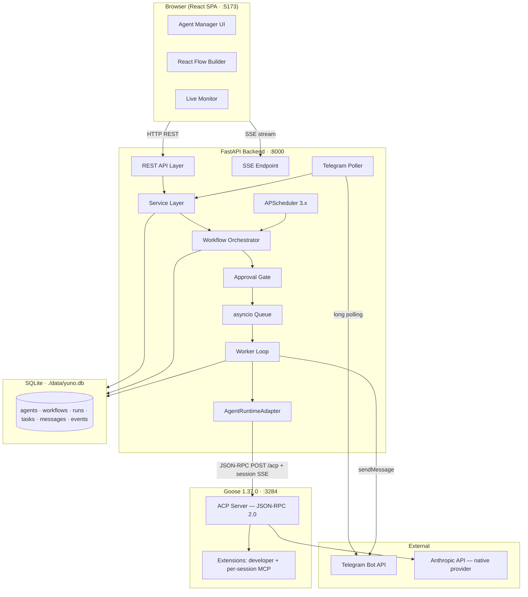

# Project Yuno — AI Agent Orchestration Platform

A local platform for defining, configuring, and executing multi-agent AI workflows. Agents are created and managed through a browser UI, wired together on a visual canvas (React Flow) into directed graphs with conditional edges and configurable feedback loops, and executed through the Goose 1.37.0 runtime. Results flow between agents via a persisted message queue. A human can interact with a connected agent over Telegram, and a trigger phrase can launch a full workflow from the same chat.

---

## Source of Truth Hierarchy

| Priority | Document | Authoritative for |
|---|---|---|
| 1 | `project_yuno.pdf` | Product requirements |
| 2 | `_bmad-output/planning-artifacts/goose-spike-report.md` | Goose 1.37.0 runtime behavior |
| 3 | `SYSTEM_DESIGN.md` | Architectural decisions and boundaries |
| 4 | `BUILD_SPEC.md` | Implementation behavior, contracts, ACs, validation |
| 5 | `_bmad-output/planning-artifacts/stories.md` | Vertical implementation sequence and hour allocation |

When these documents conflict, report the conflict; do not resolve it silently.

---

## Architecture Overview

The system is a **modular monolith**: one FastAPI process hosts the REST API, workflow orchestrator, background worker, SSE endpoint, APScheduler, and Telegram poller. Goose 1.37.0 is the agent runtime, accessed via its ACP (Agent Client Protocol) server — a JSON-RPC 2.0 + SSE interface. The platform never calls an LLM directly; an `AgentRuntimeAdapter` ABC isolates all runtime coupling. SQLite provides zero-setup local persistence.



> Mermaid syntax inspected manually. No local validator available.

---

## Prerequisites

| Requirement | Notes |
|---|---|
| Python 3.11+ | Backend runtime |
| Node 20+ | Frontend build only |
| Goose CLI 1.37.0 | `brew install block-goose-cli` |
| `ANTHROPIC_API_KEY` | Native provider required — CLI-bridge providers (claude-code, gemini-cli) are not supported |
| Telegram bot token | Create via @BotFather |
| Telegram chat_id | Your operator chat ID for the demo channel |

### Environment Variables

Copy `.env.example` to `.env` and fill in:

```bash
# Goose runtime — native provider required
GOOSE_PROVIDER=anthropic
GOOSE_MODEL=claude-sonnet-4-5
ANTHROPIC_API_KEY=sk-ant-...
GOOSE_PORT=3284

# Telegram
TELEGRAM_BOT_TOKEN=...
DEMO_TELEGRAM_CHAT_ID=...

# Application
DATABASE_URL=sqlite+aiosqlite:///./data/yuno.db
LOG_LEVEL=INFO
SEED_OFFLINE_DEMO=false
```

---

## Setup and Run

```bash
# One-time setup (non-interactive)
make setup

# Start all services
make dev
```

`make setup` installs Python and Node dependencies, creates the database, and seeds six agents and two workflow templates. `make dev` starts Goose (`:3284`), the FastAPI backend (`:8000`), and the Vite frontend (`:5173`), then runs a health preflight.

```bash
# Optional: verify Goose ACP integration before building on it
make smoke-goose
```

`make smoke-goose` opens one real ACP session with the native provider, asserts a `tool_call` event is captured, and writes an artifact to disk. Run this first on Day 1 before any app code depends on the adapter (AC-4).

---

## Runtime Choice

**Goose** was selected over OpenCode and OpenClaw (see `SYSTEM_DESIGN.md` ADR-001). Key reasons:

- ACP server with sessions, live-switchable modes (`auto`/`approve`/`smart_approve`/`chat`), and session-scoped SSE streaming
- Recipes as a validated per-agent definition format
- Native per-turn usage reporting (feeds the token/cost requirement)
- Per-session MCP extension injection via `session/new mcpServers`
- Native cron scheduler and Telegram gateway — both verified in a local spike before implementation began

**OpenCode** is a viable alternative — it ships `opencode serve` with an HTTP SDK designed for programmatic driving. It was not chosen only because the Goose spike was already complete and restarting integration risk from zero was not justified within the two-day window.

**OpenClaw** has overlapping built-in features (scheduler, memory, channels) that would blur the PRD's requirement that the *platform* own configuration UI and persistence.

The platform fails loudly if Goose is unreachable — there is no non-Goose fallback. The compliant contingency within the same runtime is `CliGooseAdapter` (`goose run --recipe --params`), built on demand only if the ACP smoke gate fails.

---

## Demo Workflow Summary

The recorded demo follows eight beats:

1. **Agents page** — six seeded agents with five config dimensions each; Telegram channel badge on Research
2. **Edit memory live** — edit a Research agent memory fact (visible in beat 8)
3. **Builder-modification** — load Dev Pipeline template, edit an edge condition, bump loop max-iterations, swap a node, save as new workflow
4. **Run + approval** — run the modified pipeline; watch tool calls; REJECTED loop fires once; APPROVED; Deployer approval gate pauses the run; click Approve; run completes with token totals
5. **Research Pipeline** — load template; inspect Analyst's skill steps
6. **Telegram trigger** — send `run research: Acme Payments Ltd — $50k limit increase`; watch agents execute; phone buzzes with result
7. **Expand run row** — full conversation trail, tool calls, per-task tokens
8. **Conversational memory** — send a plain Telegram message; reply reflects the edited memory fact

---

## Tests and Validation

> Tests are created during implementation. This section will be updated to show actual commands and results.

```bash
# Run the default test suite (8 files — three critical-path tests + must-have behaviors)
pytest

# Run the opt-in live Goose integration test (requires ANTHROPIC_API_KEY and running goose serve)
pytest -m live
```

**Critical-path tests (AC-3):**
- `test_agent_create.py` — Agent CRUD + context assembly
- `test_workflow_run_e2e.py` — 2-agent flow, mocked adapter, approval branch
- `test_message_delivery.py` — persist + deliver + ordering

**Manual validation checklist (Day 2):**
- [ ] AC-1: builder edit honored by next run
- [ ] AC-2: template loaded, modified, saved, run succeeds
- [ ] AC-5: Telegram reply reflects edited memory fact
- [ ] AC-6: 1-minute schedule fires in monitor without manual action
- [ ] AC-7: fresh-clone `make setup && make dev` works
- [ ] AC-8: full live rehearsal passes before recording

---

## How to Add a Workflow Template

> Detailed instructions will be finalized in S6. Placeholder below.

1. Design your workflow as a directed graph: identify agent nodes and conditional edges
2. Insert rows into `workflows`, `workflow_nodes`, and `workflow_edges` (or duplicate an existing workflow via `POST /workflows/{id}/duplicate` and edit in the builder)
3. Set `template_key` to a unique string if the template should appear in the Load Template picker
4. Edge `condition` values are free-form substring-match strings (e.g. `"APPROVED"`, `"NEEDS_MORE_DATA"`, `"always"`)
5. Loop edges point a `to_node_id` back to an already-executed node; set `max_iterations` to cap the loop

---

## How to Add a Messaging Channel

> Detailed instructions will be finalized in S6. Placeholder below.

1. Implement a class with `start()` and `send_message(chat_id, text)` methods following the Telegram poller's interface
2. Start it inside the FastAPI lifespan context manager alongside the Telegram poller
3. Insert a `channel_connections` row with `channel_type` set to your new channel name
4. The worker's outbound path and the UI's channel badge system are channel-type-agnostic

---

## Known Limitations

- **Tool access is at extension granularity**, not per-tool — the `developer` builtin gives an agent both file edit and shell access
- **Memory is operator-written only** — agents cannot write their own memory entries in this version
- **No run resumption** — a backend restart marks in-flight runs as failed; the PRD does not require resumption
- **Single in-process worker** — no distributed queue; not designed for concurrent multi-user load
- **Missed schedule executions** not replayed after downtime
