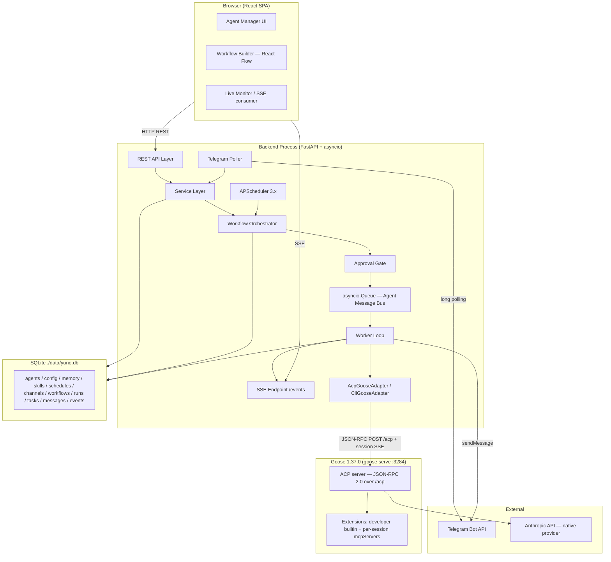

# Project Yuno — System Design

**Version 3.0 — architecture-only refactor, 2026-06-12**

> Split from v2.1 combined document. Architectural decisions and rationale live here. Binding implementation behavior, contracts, acceptance criteria, and validation requirements live in [`BUILD_SPEC.md`](BUILD_SPEC.md). The pre-split backup is at `_bmad-output/planning-artifacts/SYSTEM_DESIGN.v2.1-pre-split-backup.md`.
>
> **Source hierarchy:** PRD (`project_yuno.pdf`) > spike evidence (`goose-spike-report.md`) > this document (architecture) > `BUILD_SPEC.md` (behavior) > `stories.md` (implementation sequence). When these conflict, report the conflict rather than resolving it silently.

---

## 1. Document Purpose and Authority

This document defines:
- Why the system is designed as it is
- What the major components are and where their boundaries lie
- What architectural tradeoffs were made and why
- What architectural decisions must remain stable during implementation

This document does **not** define exact API shapes, SQL schema, state machines, event payloads, test cases, or demo scripts. Those are in [`BUILD_SPEC.md`](BUILD_SPEC.md).

---

## 2. Executive Summary

Project Yuno is a local AI Agent Orchestration Platform: a single developer defines, configures, and executes multi-agent workflows from a browser UI. Agents are wired together on a visual canvas (React Flow) into a directed graph with conditional edges and feedback loops, and executed asynchronously. The Goose 1.37.0 runtime (via its ACP server) owns LLM interaction and real tool execution. Results flow between agents via a persisted message queue. The UI receives live updates through SSE. A human can interact with a designated agent via Telegram, and a trigger phrase launches a workflow from the same chat.

**Key architectural choices:**
- **Modular monolith:** one FastAPI process, clear layer boundaries, no distributed infrastructure
- **Goose behind an adapter seam:** the platform never calls an LLM directly; an ABC isolates all runtime risk
- **SQLite:** zero-setup local persistence for a two-day demo product
- **SSE:** one-way server-to-client monitoring, history via REST refetch
- **Telegram long polling:** no public URL, no ngrok, started inside the FastAPI lifespan

---

## 3. Goals

- **G1** — Agent CRUD: create, read, update, delete agents with six PRD fields from UI and API
- **G2** — Five functional config dimensions per agent: schedules, memory, skills, interaction rules, guardrails — each observably changes runtime behavior
- **G3** — Visual workflow builder: React Flow canvas over the nodes/edges API; templates load and are modifiable
- **G4** — Two structurally different templates: dev pipeline (APPROVED/REJECTED vocabulary) and research pipeline (RISK_SCORE/NEEDS_MORE_DATA vocabulary)
- **G5** — Configurable feedback loops: edges cap re-runs; cap behavior is `forced_complete=true` (see BUILD_SPEC §9)
- **G6** — External channel: live Telegram conversation with a connected agent; trigger phrase launches a workflow
- **G7** — Live monitoring: expandable run rows with conversation trail, tool calls, token/cost totals via SSE
- **G8** — Real tool execution: agents run real tools through Goose's extension system
- **G9** — Single setup command: `make setup` then `make dev`, non-interactive
- **G10** — Two-day delivery: everything demonstrable within two days; deliverables have explicit Day-2 slots

---

## 4. Non-Goals

Deliberately excluded from this version:

- Multi-tenancy, production auth/authz (single local user; localhost-only)
- Distributed task queue (asyncio.Queue in-process; no Redis/Celery)
- WhatsApp or Slack (Telegram only; see ADR-006)
- Crash recovery / run resumption (backend restart marks in-flight runs failed; PRD never asks for resumption)
- At-least-once delivery with idempotency machinery (single worker, FIFO, persisted messages)
- SSE `Last-Event-ID` replay (reconnect refetches REST history)
- HTTP rate-limit middleware (per-agent run-rate is a worker guardrail, not middleware)
- Alembic migrations (`metadata.create_all` at startup; fresh-DB demo product)
- Non-Goose fallback (no DirectLLM/LangChain adapter; see ADR-009)
- Token-by-token streaming to the UI (SSE carries structured events, not raw token streams)
- Horizontal scaling, production observability, agent versioning, Telegram attachments

---

## 5. Constraints and Assumptions

### Hard Constraints

- **C1** — Two-day deadline: demo-ready within two calendar days
- **C2** — Local execution only: single developer machine; no cloud, no ngrok
- **C3** — Goose as the agent runtime (see ADR-001): the PRD offers OpenClaw, OpenCode, or Goose; Goose 1.37.0 was chosen and de-risked by a local spike; README presents this as a justified choice, not a mandate
- **C4** — Native API provider required: `GOOSE_PROVIDER=anthropic` + `ANTHROPIC_API_KEY`; CLI-bridge providers (`claude-code`, `gemini-cli`) must not be used — the spike proved tools execute inside the bridged subprocess with no `tool_call` events crossing ACP and approve mode silently bypassed
- **C5** — Telegram as external channel: long polling, BotFather token, no webhook
- **C6** — SQLite at `./data/yuno.db`: zero-install, file-based
- **C7** — Demo reliability: the demo workflow completes in under ~3 minutes

### Technology Constraints

- **C8** — Python 3.11+ (asyncio `TaskGroup`, modern typing)
- **C9** — Node 20+ for the frontend only; Goose is a self-contained binary (`brew install block-goose-cli`) and does not require Node
- **C10** — FastAPI + asyncio backend; React + Vite frontend (port 5173); React Flow for the builder canvas
- **C11** — APScheduler `>=3.10,<4` with `AsyncIOScheduler` (4.x API is incompatible; 3.x pin matches 3.x code)

### Assumptions

- **A1** — Developer supplies `ANTHROPIC_API_KEY` in `.env` on Day 1 (pending the live `tool_call` capture, gated as the first act of Day 1)
- **A2** — Telegram bot token from @BotFather and the demo operator's `chat_id` are in `.env`
- **A3** — Internet access during the demo (LLM API + Telegram polling)
- **A4** — Single user; SQLite single-writer is not a bottleneck
- **A5** — macOS/Linux; Windows best-effort

---

## 6. Architecture Overview

### 6.1 Component Diagram

### 6.2 Trust and Process Boundaries

- **Browser (untrusted):** REST + SSE only; Pydantic validation at the API layer; no auth in the MVP (localhost-only by design)
- **Backend process (trusted, localhost):** owns all application logic; holds `TELEGRAM_BOT_TOKEN` and `ANTHROPIC_API_KEY` from `.env`; never returns them in responses; logs truncate payloads and redact secret-shaped fields
- **Goose process (trusted, localhost):** `goose serve` on `127.0.0.1:3284`; no HTTP auth on this surface (spike §3 — no Bearer token, no `X-Secret-Key`); the only credential is the provider key passed to the Goose process via environment; Goose makes all outbound LLM calls
- **SQLite (trusted, local FS):** `./data/yuno.db`, accessed only through the repository layer
- **External services (untrusted network):** Telegram Bot API and Anthropic API over HTTPS; failures isolated and surfaced loudly

---

## 7. Architectural Principles

1. **Modular monolith:** one FastAPI process hosts the REST API, orchestrator, worker, SSE endpoint, scheduler, and Telegram poller. Clear layer boundaries (routers → services → adapters → repositories) satisfy the PRD's required layer separation without distributed infrastructure overhead.
2. **Runtime isolation through an adapter:** the platform never calls an LLM directly. `AgentRuntimeAdapter` (ABC) isolates all runtime coupling. The seam means the runtime can be swapped or the contingency path activated without touching orchestration or persistence.
3. **Platform-owned orchestration:** the platform owns workflow graph traversal, edge evaluation, feedback-loop counting, approval gating, and message routing. The runtime owns only LLM interaction and tool execution. No orchestration logic lives in Goose.
4. **Persist before dispatch:** every agent message is written to the DB before being enqueued. The conversation trail is always consistent with what has been processed, regardless of worker state.
5. **Observable failures:** no silent fallbacks, no auto-degradation. When the runtime fails, the run fails with a structured event and a log line. The operator re-runs after fixing the cause.
6. **Local-first operation:** all processes bind to localhost; no public URLs, no Docker, no cloud dependencies for the demo.
7. **Minimal infrastructure for the two-day MVP:** asyncio.Queue instead of Redis, SQLite instead of Postgres, `create_all` instead of Alembic, long polling instead of webhooks.

---

## 8. Component Boundaries and Responsibilities

### REST API Layer (FastAPI routers)
Owns HTTP lifecycle, Pydantic validation, routing to services, and OpenAPI schema. Does not contain business logic. See BUILD_SPEC §6 for the exact endpoint surface.

### Service Layer
Owns business logic, transactional CRUD, schedule registration with APScheduler, and context assembly inputs. Does not own HTTP concerns, execution, or runtime calls.

### Workflow Orchestrator
Owns graph traversal, conditional-edge evaluation, feedback-loop cap enforcement, run/task creation, and routing next messages through the Approval Gate. Interface: `start_workflow_run(workflow_id, initial_input) → run_id`; `advance_workflow(run_id, completed_task)`. See BUILD_SPEC §9 for the exact evaluation algorithm.

### Approval Gate
Owns the pre-dispatch check: if the next node's agent has `requires_approval=true`, the run is paused **before** that node's message is enqueued. Entirely platform-controlled; no runtime cooperation required. See BUILD_SPEC §14 for the exact approval contract.

### Worker Loop (asyncio.Queue consumer)
Owns dequeueing messages FIFO, guardrail checks before/after invocation, dispatching to the adapter with timeout, persisting task output, advancing the workflow, sending outbound Telegram replies, and emitting SSE events. Failure stance: an adapter error fails the task and run loudly; no retry engine, no fallback adapter.

### AgentRuntimeAdapter (AcpGooseAdapter / CliGooseAdapter)
Owns translating a `TaskInput` into one Goose execution and returning a `TaskResult`. ACP session lifecycle or CLI subprocess lifecycle. Forwarding `tool_call` / `usage_update` events to the event bus mid-run. Does not own retry, routing, or DB access. See BUILD_SPEC §7 for the exact protocol contract.

### SSE Endpoint
Owns per-run lists of subscriber queues (multiple browser tabs supported), streaming events, and persisting every emitted event to `execution_events`. Reconnect = client refetches REST history and resubscribes.

### Scheduler (APScheduler 3.x)
Owns loading enabled schedule rows into `AsyncIOScheduler`, on fire starting a workflow run or single-agent task through the same orchestrator/queue path.

### Telegram Poller
Owns long polling, chat_id lookup, inbound message persistence, and routing each inbound to exactly one path (conversational or workflow trigger). Exposes `send_message` for the worker's outbound replies. See BUILD_SPEC §15 for the exact routing contract.

### Persistence Layer
Owns all DB access via async repositories, `metadata.create_all` at startup, and transaction boundaries.

---

## 9. Major Data Ownership

Each component owns its own writes:

| Data | Owner | Tables |
|---|---|---|
| Agents + config | Service Layer | `agents`, `agent_config` |
| Config dimensions | Service Layer | `memory_entries`, `skills`, `schedules`, `channel_connections` |
| Workflow graphs | Service Layer + Builder | `workflows`, `workflow_nodes`, `workflow_edges` |
| Runs + tasks | Orchestrator + Worker | `workflow_runs`, `agent_tasks` |
| Agent-to-agent messages | Worker + Poller | `agent_messages` |
| Approval requests | Approval Gate | `approval_requests` |
| Event log | SSE Endpoint | `execution_events` |

No component reads from a table it doesn't own except through a repository call. See BUILD_SPEC §5 for the complete entity definitions and SQL schema.

---

## 10. Workflow and Messaging Architecture

### Design

The workflow graph is stored in the DB as nodes and edges, making the React Flow builder an additive UI over an already-complete data model. Edge conditions are free-form strings evaluated as case-insensitive substring matches — this single rule powers both seed templates' different vocabularies without a special-cased enum. Feedback loops are ordinary edges pointing to already-executed nodes, capped by a counter the orchestrator maintains per run.

The message bus is an `asyncio.Queue` (in-process, FIFO, `maxsize=1000`). The design choice is intentional: for a single-user two-day demo, a durable queue adds setup and failure surface for no observable benefit. The persisted `agent_messages` rows **are** the PRD-required conversation trail; the queue is delivery only.

The worker is a single consumer. Within a run, message ordering is guaranteed. Messages from concurrent runs may interleave but are isolated by `run_id`.

### Rationale

Storing graphs in the DB (vs. JSON config files) made the builder an additive UI task rather than a file-format problem. Free-form conditions (vs. an enum) were required by the demo templates' own different vocabularies — the enum approach made conditions look hardcoded. A feedback loop cap that completes with `forced_complete=true` rather than failing was chosen because a capped disagreement is not an error; the last valid output is accepted as final and the run concludes cleanly for the recording.

See BUILD_SPEC §9–§11 for the exact state machines, edge evaluation algorithm, loop cap semantics, and message envelope.

---

## 11. Goose Runtime Architecture

### Why Goose

Goose 1.37.0 was chosen over OpenCode and OpenClaw (see ADR-001) and de-risked by a local spike before any app code was written. Key verified properties: ACP server with sessions and session-scoped SSE streaming; recipes as a validated per-agent definition format; live-switchable session modes (`auto`/`approve`/`smart_approve`/`chat`); native per-turn usage reporting; per-session MCP extension injection; provider-agnostic model support. These properties map directly onto the PRD's five agent-config dimensions.

### Adapter Seam

`AgentRuntimeAdapter` (ABC) is the single seam isolating all runtime coupling. Both `AcpGooseAdapter` (primary) and `CliGooseAdapter` (contingency) implement the same interface. All orchestration, persistence, and routing code above the seam is runtime-agnostic.

### ACP Primary Path

`AcpGooseAdapter` opens an ACP session per task: `goose serve` starts on port 3284; the adapter sends JSON-RPC 2.0 over `POST /acp` and receives responses over a session-scoped SSE stream. The session-scoped stream (both `acp-connection-id` and `Acp-Session-Id` headers) is required for session-update notifications; the spike proved a connection-only stream receives none of them.

The native provider requirement (C4) is the most load-bearing architectural constraint: with a CLI-bridge provider, tools execute inside the bridged subprocess — no `tool_call` events cross ACP, no permission requests are emitted, and approve mode is silently bypassed. The platform's tool feed, session modes, and usage events are only real when Goose owns the tool loop.

See BUILD_SPEC §7 for the complete verified ACP protocol contract (header names, method names, request/response shapes, event types, error behavior).

### Compliant CLI Contingency

`CliGooseAdapter` is built on demand only if the ACP smoke gate fails at hour 0 of Day 1, or if an agent's guardrails block the `developer` builtin (per-session removal of a server-level builtin is not a verified ACP mechanism; the CLI path's recipe `extensions:` list is per-run and verified). It uses the same runtime (`goose run --recipe --params --no-session`) and produces a `TaskResult` via the same ABC. It is not a compliance downgrade — the same runtime still executes agent logic and tools. The tradeoff: no mid-run `tool_call` event stream and no native usage notifications (token fields fall back to a client-side estimate labeled as such in the UI).

There is no non-Goose fallback. See ADR-009.

---

## 12. External Channel Architecture

### Why Telegram

| Criterion | Telegram | Slack | WhatsApp |
|---|---|---|---|
| Setup time | 5 min (BotFather) | 20–30 min (app config) | Days (Meta approval) |
| Local dev | Polling — no ngrok | Socket Mode — workable | No local path |
| Demo reliability | High | Medium | Low |
| Verdict | **Chosen** | Second choice | Not feasible |

### Why Platform-Owned Polling

`python-telegram-bot>=21` long polling, started inside the FastAPI lifespan. The Goose-native `goose gateway start --bot-token <T> telegram` alternative was verified in the spike but rejected: the PRD requires the platform to show channel wiring — messages in the UI trail, per-agent channel badges, routing into platform workflows. A gateway that bypasses the platform's persistence layer satisfies none of that.

The platform owns the consumption path entirely: one path per inbound message (trigger or conversational), persisted before routing, no double-execution. The worker owns outbound sends after the Publisher node completes. See BUILD_SPEC §15 for the exact routing contract.

---

## 13. Real-Time Update Architecture

SSE (`sse-starlette`) was selected over WebSockets because the monitoring use case is one-way server-to-client — SSE's exact shape. WebSockets add bidirectional complexity for no benefit here.

Key design choices:
- Per-run subscribers are a **list of queues** so multiple browser tabs each receive the full stream (v1's single-queue design silently dropped events for the second tab)
- No `Last-Event-ID` replay machinery: on reconnect the client refetches `GET /runs/{id}/events` (REST history from `execution_events`) then resubscribes — simpler and the history endpoint already existed
- Run-less events (conversational/scheduled tasks) are persisted with `run_id NULL` and `agent_id` set, and delivered on an agent-keyed subscriber list

See BUILD_SPEC §12 for the complete event catalog (names, triggers, required fields, persistence behavior).

---

## 14. Persistence Architecture

SQLite at `./data/yuno.db` via `aiosqlite` + SQLAlchemy. `Base.metadata.create_all` at startup. No Alembic.

Rationale: zero-setup for an evaluator; single-user SQLite single-writer is not a bottleneck; Alembic migrations are pointless for a fresh-DB demo product and the time funds the builder instead.

Transaction boundaries: agent+config creation is one transaction; worker task-completion writes (task update, run totals, next message insert, event insert) are one transaction; adapter invocation happens outside any transaction.

See BUILD_SPEC §5 for the complete entity definitions and SQL schema.

---

## 15. Scheduling Architecture

Platform-owned APScheduler 3.x (`AsyncIOScheduler`) rather than Goose's native scheduler.

Rationale: the platform needs DB+UI ownership of schedules — schedule rows must be CRUD-able in the UI, joined to agents, and their firings must appear in the platform monitor. Goose's `goose schedule` (verified working in the spike) is documented as the alternative in the README but rejected because its scheduler state is not accessible to the platform's DB or UI.

API-created/deleted schedules register/replace/remove the APScheduler job live. Fired runs flow through the normal orchestrator/queue path and are visible in the monitor. Missed executions during downtime are not replayed (disclosed limitation).

See BUILD_SPEC §16 for the scheduling contract.

---

## 16. Security and Trust Boundaries

### Secrets

`.env` (gitignored; `.env.example` committed) loaded via `pydantic-settings`: `ANTHROPIC_API_KEY`, `TELEGRAM_BOT_TOKEN`, `DEMO_TELEGRAM_CHAT_ID`, `GOOSE_MODEL`. Never logged, never serialized in responses, never stored in the DB. There is no Goose API key — the ACP surface has no HTTP auth (spike §3); v1's `GOOSE_API_KEY` machinery is deleted.

### Localhost Surface

`goose serve` binds `127.0.0.1:3284` with no auth; the FastAPI app binds `127.0.0.1:8000` with no auth. Both are single-user local surfaces by design. The README states: do not bind either beyond localhost without adding auth.

### Prompt Injection Boundary

Channel and inter-agent text enters only the `## Task` section of the assembled prompt, never the persona sections (system prompt, memory, skills). The blast radius of injected instructions is bounded by the agent's extension list and guardrails.

### Dangerous Tools

The `developer` extension (file edit + shell) is the main risk surface. Sessions run with `cwd` pinned to a per-run workspace directory. Agents carry only the extensions they need. Approval-gated agents (e.g. Deployer) add a human checkpoint before dispatch.

---

## 17. Observability and Failure Visibility

### Structured Logs

`structlog` JSON lines per event: `timestamp, level, run_id, task_id, agent_id, component, event, duration_ms, tokens, cost_usd, error, extra`. `LOG_LEVEL` env var; DEBUG adds `acp_session_id` and `edge_condition_evaluated`. Payload fields truncated to 200 chars; `api_key`/`token`/`secret`/`password` fields redacted.

### Failure Stance

Fail loudly, stay debuggable. No silent fallbacks, no auto-degradation. See BUILD_SPEC §9 for exact failure behavior per failure mode.

| Failure | Design choice |
|---|---|
| Goose unreachable at startup | Startup aborts; remediation message names the fix |
| Goose error mid-run | Task + run marked `failed` with verbatim error event; no retry |
| Provider key missing | `session/prompt` fails fast with HTTP 400 naming the env var |
| Task timeout | `asyncio.wait_for` around `invoke()`; timeout fails the task and run |
| Guardrail breach | Run halts with `guardrail_triggered`; this is a feature demonstration |
| Backend restart mid-run | Stale `running` runs marked `failed (interrupted)` at startup |
| SSE disconnect | EventSource auto-reconnects; client refetches REST history |

---

## 18. Deployment and Local Development Architecture

### Processes and Ports

| Service | Started by | Port |
|---|---|---|
| `goose serve` (ACP) | `make dev` | 3284 |
| FastAPI backend (worker, scheduler, poller in lifespan) | `make dev` | 8000 |
| Vite frontend | `make dev` | 5173 |
| SQLite | file `./data/yuno.db` | — |

The FastAPI app uses the lifespan context manager (not deprecated `@app.on_event`) to start the worker loop, APScheduler, and Telegram poller.

### Setup Sequence

`make setup` (one-time, non-interactive): python venv + deps, frontend npm install, `create_all` DB at `./data/yuno.db`, seed agents/templates/channel (chat_id read from `.env`).

`make dev`: starts `goose serve --port 3284 --with-builtin developer`, uvicorn :8000, vite :5173, then runs a health preflight check.

The health check runs after servers start (v1's broken ordering — curling a server only `make dev` starts — is fixed). See BUILD_SPEC §19 for the complete setup and environment-variable specification.

### Seed Data

Six agents (Coder, Reviewer, Deployer with `requires_approval=true`, Research with memory entries and Telegram channel connection, Analyst with `risk_scoring_skill`, Publisher). Two templates (Dev Pipeline, Research Pipeline). Research fixtures file and writable reports directory. No fabricated Telegram conversation.

No seeded agent blocks the `developer` builtin, so the `CliGooseAdapter` contingency is not required on Day 1.

---

## 19. Architectural Decision Records

### ADR-001: Runtime Selection — Goose

**Status:** Accepted (rewrites v1, which cited a fictional `goosed` REST API and fabricated dismissals of the alternatives).

**Context:** The PRD offers OpenClaw, OpenCode, or Goose; the candidate must choose one and justify the tradeoff. A live session will probe this justification.

**Decision:** Goose 1.37.0 via its ACP server (`goose serve`), with the recipe/CLI path as the in-runtime contingency.

**Why Goose — verified by local spike:** ACP server with sessions, live-switchable modes (`auto`/`approve`/`smart_approve`/`chat`), session-scoped SSE streaming; recipes as a validated per-agent definition format; native cron scheduler and native Telegram gateway (both exercised locally); native per-turn usage reporting feeding the PRD's token/cost requirement; MCP extension ecosystem with per-session injection; provider-agnostic model support (60+ providers). The spike already de-risked integration on this machine.

**Alternatives — honestly presented:**
- **OpenCode** — ships `opencode serve` with an HTTP API and an SDK designed for programmatic driving: a **viable** choice. Rejected because Goose's extension/session/mode model maps more directly onto the PRD's five agent-config dimensions, and because the completed spike had already de-risked Goose while OpenCode would restart integration risk from zero.
- **OpenClaw** — native scheduler, memory system, multi-channel support overlapping several PRD dimensions. Rejected for heavier setup and less programmatic control in the available time; its built-in features would also blur the PRD's requirement that the platform own configuration UI and persistence.

Neither alternative "lacks an API" — v1's claims to that effect were false and are retracted.

**Consequences:** Dependence on a localhost Goose process; JSON-RPC + SSE header integration rather than plain REST; native API provider mandatory (C4). All isolated behind `AgentRuntimeAdapter`.

### ADR-002: FastAPI Modular Monolith

**Status:** Accepted. Routers → services → adapters → repositories in one asyncio process. Celery/microservices rejected for a two-day single-user tool. Directly satisfies the PRD's layer-separation requirement.

### ADR-003: SQLite + aiosqlite + SQLAlchemy

**Status:** Accepted. Alembic dropped for `metadata.create_all` (fresh-DB demo product). Postgres/Redis/JSON-file alternatives rejected (setup overhead; single-user; no schema evolution needed).

### ADR-004: asyncio.Queue Message Bus

**Status:** Accepted. Persist-then-enqueue + single FIFO worker. At-least-once/idempotency/recovery extras deleted (PRD never asks; single-process makes them redundant). Queue bound: 1000.

### ADR-005: SSE via sse-starlette

**Status:** Accepted. One-way monitoring is SSE's exact shape; WebSockets rejected. `Last-Event-ID` replay dropped — reconnect refetches REST history. Per-run subscriber lists (multi-tab support).

### ADR-006: Telegram via Platform-Owned Polling

**Status:** Accepted. `python-telegram-bot` v21+ long polling in the FastAPI lifespan; single consumption path. Goose's native `goose gateway` rejected — the platform must own channel wiring, the UI trail, and per-agent badges. Slack/WhatsApp rejected (setup time and local-dev feasibility).

### ADR-007: Workflow Graph in DB

**Status:** Accepted. Nodes/edges tables make the builder an additive UI over a complete data model. Edge conditions became free-form contains-match strings, deleting the self-contradicting CHECK enum from v1 (which rejected v1's own demo data).

### ADR-008: Monolith vs Distributed

**Status:** Accepted. Single asyncio process with internal concurrency. Distributed infrastructure (Redis Streams, worker pool) deferred to the evolution path.

### ADR-009: No Non-Goose Fallback

**Status:** Accepted. `DirectLLMAdapter` and any auto-fallback deleted. The PRD requires the chosen runtime to actually execute agent logic; a raw-SDK fallback (no tool execution) is non-compliant regardless of disclosure. The compliant contingency is the same runtime via a different transport — `CliGooseAdapter` (§11, verified in the spike). If Goose breaks, the platform fails loudly.

---

## 20. Evolution Path

| Capability | Mechanism | Complexity |
|---|---|---|
| Goose session modes as tool-level interaction rules | `session/set_mode` + `session/request_permission` handling, once Day-1 smoke verifies event capture | Low |
| Agent-written memory | Platform MCP extension exposing `remember(key, value)`; or parse a `REMEMBER:` convention from output | Low |
| Slack channel | `SlackChannelAdapter` with the poller's `start()`/`send_message()` interface; `channel_type="slack"` | Low |
| Second runtime (OpenCode) | `OpenCodeAdapter` against `opencode serve` — the ABC already isolates it | Medium |
| Durable queue / parallel workers / multi-tenancy / production auth and observability | Redis Streams, worker pool, JWT, OTel | Medium–High |

---

## 21. Architecture Amendment Log

| Date | Change | Impact |
|---|---|---|
| 2026-06-12 | v1.0 → v2.0: replaced fictional `goosed` REST API with spike-verified ACP integration; reinstated visual builder; made all five config dimensions functional; replaced SSE-interception approval with pre-dispatch gate; deleted DirectLLM fallback and non-required infrastructure | Major |
| 2026-06-12 | v2.0 → v2.1: 7 surgical patches from readiness report (APScheduler pin, edge condition free-form, nullable run_id/node_id + source column, blocked_extensions additive-only, cross-reference corrections) | Minor |
| 2026-06-12 | v2.1 → v3.0: documentation refactor — architectural reasoning separated from binding implementation behavior; binding contracts moved to `BUILD_SPEC.md`; no scope, behavior, state transition, acceptance criterion, runtime claim, or approved time allocation changed | Structural |
